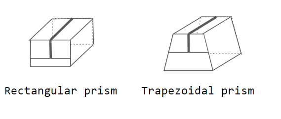
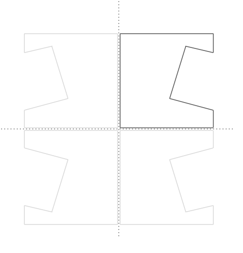
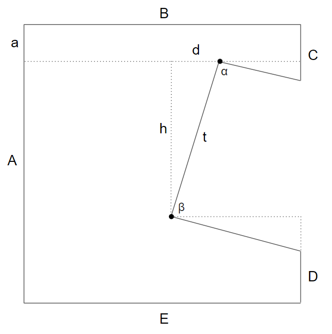
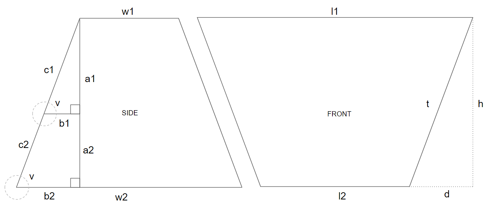

## Packman Pouch Pattern Generator

Shiny application to generate pattern for MYOG bags/pouches. Covers rectangular and trapezoidal prisms as weell as truncated pyramid shapes. 

### How to lay out

### Trigonometry calculations reference
See `make_pattern()` in utils.R for actual R formulas

